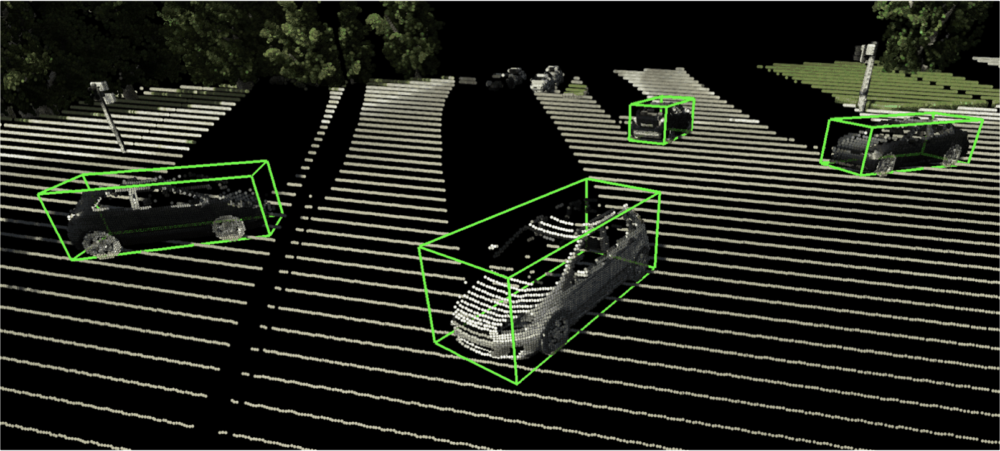

# Active Perception using Light Curtains for Autonomous Driving

*Project Website*: https://siddancha.github.io/projects/active-perception-light-curtains

<p align="left">
    
</p>

This is the official code for our paper:

>Siddharth Ancha, Yaadhav Raaj, Peiyun Hu, Srinivasa G. Narasimhan, and David Held.<br>
*[Active Perception using Light Curtains for Autonomous Driving.](https://www.ecva.net/papers/eccv_2020/papers_ECCV/papers/123500732.pdf)*<br>
In **European Conference on Computer Vision (ECCV)**, August 2020.

## Installation

1. Clone repository.
```bash
git clone git@github.com:siddancha/active-perception-light-curtains.git
```

2. Install `pylc`
```bash
cd /path/to/second.pytorch/pylc
mkdir build && cd build
cmake -DCMAKE_BUILD_TYPE=Release .. && make
```

3. Install [spconv](https://github.com/traveller59/spconv).

4. Add required paths to the `$PYTHONPATH`.
```bash
export PYTHONPATH=$PYTHONPATH:/path/to/second.pytorch
export PYTHONPATH=$PYTHONPATH:/path/to/second.pytorch/pylc
export PYTHONPATH=$PYTHONAPTH:/path/to/spconv
```

## Data preparation

Download the [Virtual KITTI](https://europe.naverlabs.com/research/computer-vision-research-naver-labs-europe/proxy-virtual-worlds-vkitti-1/) and [SYNTHIA-AL](https://synthia-dataset.net/downloads/) datasets into folders called `vkitti` and `synthia`. Then, create their info files that contain their respective metadata using the following commands:

```bash
export DATADIR=/path/to/synthia/and/vkitti/datasets

# create info files for Virtual KITTI dataset
python ./data/vkitti_dataset.py create_vkitti_info_file
    --datapath=$DATASET/vkitti

# create info files for the SYNTHIA dataset
python ./data/synthia_dataset.py create_synthia_info_file
    --datapath=$DATASET/synthia
```

## Training

To train a model, run the following commands:

```bash
cd second
python ./pytorch/train.py train
    --config_path=./configs/{dataset}/second/{experiment}.yaml
    --model_dir=/path/to/save/model
    --display_step=100
```
where  `dataset` is either `vkitti` or `synthia` . We will be releasing our pre-trained models shortly.

## Evaluation

To evaluate a model, run the following commands:

```bash
cd second
python ./pytorch/train.py evaluate
    --config_path=./configs/{dataset}/second/{experiment}.yaml
    --model_dir=/path/to/saved/model
    --result_path=/path/to/save/evaluation/results
    --info_path=/info/path/of/dataset/split
```

## Launch all experiments on `slurm`

In order to facilitate reproducibiilty, we have created a script that launches all experiments included in our paper, on a compute clustered managed by [slurm](https://slurm.schedmd.com/documentation.html). In order to launch all experiments, simply run the following

```bash
cd second
python ./launch_all_exp.py
```

This will automatically schedule training of all experiments using sbatch commands provided in `second/sbatch.py`.

## Notes
- The codebase uses Python 3.7.
- The codebase is built upon the [SECOND](https://github.com/traveller59/second.pytorch) repository.
